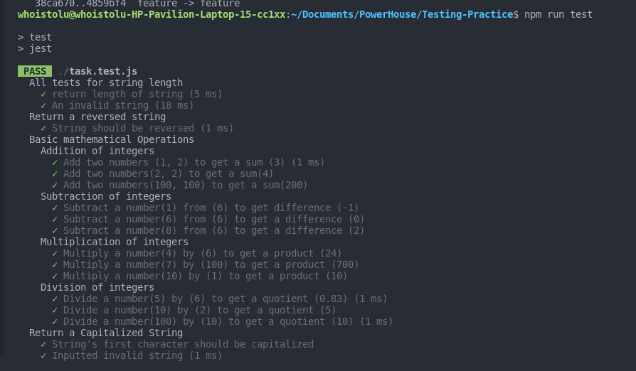

# Testing Practice

A few practical tests for JavaScript functions using the [Jest library](https://jestjs.io/).
I followed the [AAA](https://github.com/goldbergyoni/javascript-testing-best-practices#-%EF%B8%8F-12-structure-tests-by-the-aaa-pattern) pattern to make the tests easier for other developers to read and understand.

## Built With

- JAVASCRIPT
- Jest

## To get a local copy run the following steps:
- Copy [this link](https://github.com/Whoistolu/Testing-Practice)
- Open your terminal or command line
- Run "git clone Paste [this link](https://github.com/Whoistolu/Testing-Practice)"
- Open the folder with your code editor
- Create a branch to work on
- Now You can edit the code and do a pull request

## Authors

👤 **Author1**

- Name: Ajise Toluwase
- GitHub: [@githubhandle](https://github.com/Whoistolu)
- Twitter: [@twitterhandle](https://twitter.com/Littletolu)
- LinkedIn: [LinkedIn](https://www.linkedin.com/in/toluwase-ajise-9b40411b2/)

## 🤝 Contributing

Contributions, issues, and feature requests are welcome!

## Show your support

Give a ⭐️ if you like this project!

## Acknowledgments

- Inspiration

## 📝 License

This project is [MIT](./MIT.md) licensed.
